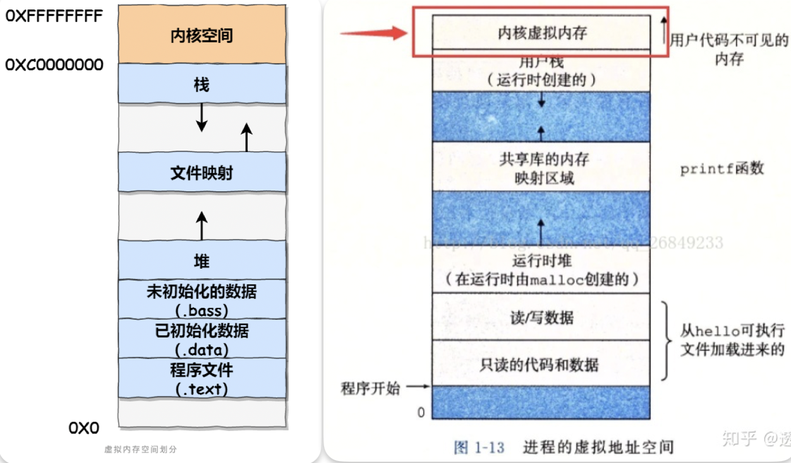

**生存期：**

1.静态：在整个程序运行时都在，不会被销毁。有2种情况（1.直接在文件作用域定义，如普通的全局变量。2.通过static在块作用域内定义的东西）。

2.自动（局部变量）：只生存在代码块中，如函数、循环、条件语句等，代码运行跳出后彻底消失。

3.动态（new，malloc）：由程序员控制出生和死亡。

**作用域**：

1.块/局部作用域(标识符定义点开始)：函数，循环等。

2.文件作用域：在函数外部定义的东西，可在整个文件中可见和访问。（可通过加static把变量限制在文件作用域）。

Tips：在局部标识符的作用域中若要使用与其同名的全局标识符，则需要用全局域选择符（::）对全局标识符进行修饰（受限）。

`如,没有设置namespace的情况：`

`int x = 5; // 全局作用域的变量`

`int main() {`

`    int x = 10; // 当前作用域的变量`

`    ::x = 15;   // 修改全局作用域的变量`

`    return 0;`

`}`

---

**结合linux进程虚拟地址空间来讨论（**直接看【操作系统】笔记就行**）**

首先虚拟地址空间分为分为用户空间和内核空间。



栈区（stack）：空间小，系统自动创建销毁。生长方向是由高地址向低地址生长。大小固定，但是有系统参数可供调整。内存的分配是连续的。对于函数的内存分配：只有当程序执行到调用函数时，系统才会分配内存空间给函数和其中的局部变量等(除了static变量，它不在栈中)，这个叫栈帧是栈中的一个单元，函数执行结束时，栈帧空间全部回收。***所以，程序刚开始执行main()函数的时候，main()函数内部的局部变量在main()的栈帧中并存在栈上，而其他函数没有任何变量在栈中直到被调用。***

堆区（heap）：这个很关键，也是c/c++较很多语言灵活的地方，程序员手动开辟，手动释放，程序结束时可能由 OS 回收。使用关键字malloc/new,free/delete对其开辟释放空间，每个人电脑的空间都是有限的。生长方向与栈区相反。在内存中的分布不是连续的。

数据段：见【操作系统】笔记。

```c
// 作用域和生存区相关：
#include <stdio.h>
int lint = 1;   // lint具有文件作用域、静态生存期
void print()
{
    int i, *p=NULL;  // 作用域开始，局部变量
    for(i=0; i<lint; i++)
    {
        static int temp = 1;    // 具有代码块作用域、静态生存期,只初始化一次，后续不会再赋值一次1.
        temp++;
        p = &temp;  // p指向temp所在地址
    }
    . . .
    // printf(“temp = %s\n”, temp); // 错误，temp 已离开作用域
    printf(“temp = "%d\n", *p);  // 正确，temp 不可见，但是一直存在，其地址也可用
}

int main(void)
{
    int c;
    for(c=0;c<=3;c++)
    {
        print();
    }
    return 0;
}

```

结果

temp = 2 temp = 3 temp = 4

在调用包含具有代码块作用域静态变量temp的函数时，由于其一直存在，temp只在编译时初始化一次。

**详细，未看**

[https://blog.csdn.net/helloo\_jerry/article/details/80107601](https://blog.csdn.net/helloo_jerry/article/details/80107601)