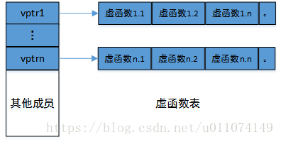

**虚函数表**

 虚函数表是指在每个包含虚函数的类中都存在着一个函数地址的数组。当我们用父类的指针来操作一个子类对象的时候(经过动态绑定的)，这张虚函数表指明了实际所应该调用的函数。 

一些表面上的规律：

* 虚函数表在代码的编译阶段就构造出来了，运行时存放在常量区(.rodata)中，虚函数代码和普通函数一样在代码段(.text).
* 每一个有虚函数的类都有一个虚函数表，且整个类共有。
* 有虚函数表的类的任何对象在内存中的前8个字节(64位机器)都是一个指针，指向虚函数表。
* 子类继承父类，父类包含虚函数，那么子类对象很显然有虚函数表。

浅析C++类的内存布局(浅析只看这2个就够了)

[https://www.zhihu.com/tardis/zm/art/380147337?source\_id=1003](https://www.zhihu.com/tardis/zm/art/380147337?source_id=1003)

<https://bbs.huaweicloud.com/blogs/302735>

深度解析C++虚函数表和内存结构(这个最屌！解决所有剩余疑问)

<https://www.cnblogs.com/ylaoda/p/13390902.html>

*如图，这是一个子类对象的内存分布(忽略变量顺序)，这个子类继承了多个父类，所有有多个虚函数表，即对象内存空间中存在多个虚函数表指针，指向不同的**虚函数表**。(具体内存结构件上面链接)*



在同一个虚函数表中，虚函数按照声明的顺序放在表中，父类的虚函数排在前面，子类的虚函数排在后面。

```c


class A
{
public:
    int i;
    virtual void func() {}
    virtual void func2() {}
};
class B : public A
{
    int j;
    void func() {}
};
虚函数动态绑定的实现  //参考ppt p53开始

TODO 内存空间（虚函数，父子类继承的情况）
```

**类的大小，class的大小**

<https://blog.csdn.net/fengxinlinux/article/details/72836199>

-首先，类大小的计算遵循结构体的对齐原则。

-类的大小与普通数据成员有关，与成员函数和静态成员无关。即普通成员函数，静态成员函数，静态数据成员(static)，静态常量数据成员均对类的大小无影响。

-虚函数对类的大小有影响，是因为虚函数表指针带来的影响。

-虚继承对类的大小有影响，是因为虚基表指针带来的影响

-空类的大小是一个特殊情况,空类的大小为1。

todo