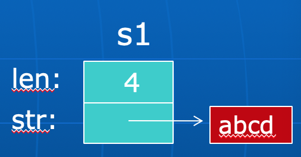

**对象/类(Object&Class)**

---

•对象是由数据及能对其实施的操作所构成的封装体。

•类描述了对象的特征（包含哪些数据和操作）。

 数据（数据成员、成员变量、实例变量、对象的局部变量等）

 操作（成员函数、方法、消息处理函数等）

•对象属于值的范畴，而类则属于类型的范畴；对象要通过类来创建.

**继承(Inheritance)**

---

•在定义一个新的类（派生类、子类）时，可以把已有类（基类、父类）的一些特征描述先包含进来，然后再定义新的特征。

•单继承与多继承。

**多态性(Polymorphism)与动态绑定(Dynamic Binding)**

---

**多态：某一论域中的一个元素存在多种解释。**

一名多用 ***(见其他笔记)***

* C++运算符重载（语言预定义和用户自定义，operator关键字）
* C++函数重载（同名函数能对多种类型的数据进行操作）
* C++模版template

面向对象程序特有的多态（继承机制带来的）：

对象类型的多态：子类对象既属于子类，也属于父类。

对象标识的多态：父类的引用或指针可以引用或指向父类对象，也可以引用或指向子类对象。

消息的多态：发给父类对象的消息也可以发给子类对象，即，一个消息集有多种解释（父类与子类有不同解释）。

**绑定：确定对多态元素的某个使用是多态元素的哪一种形式。**

**
**

静态绑定（Static Binding，也称前期绑定，Early Binding）：在编译时刻确定。

动态绑定（Dynamic Binding，也称后期绑定或延迟绑定，Late Binding）：在运行时刻确定。

多态带来的好处：

* 易于实现程序高层（上层）代码的复用。
* 使得程序扩充变得容易（只要增加底层的具体实现）。
* 增强语言的可扩充性（操作符重载等）。

**对象基本属性**

```c
1.可以对同类对象进行赋值
Date yesterday,today,some_day;
some_day = yesterday; //默认是把对象yesterday的
		//数据成员分别赋值给对象some_day的相应数据成员
		
2.把对象作为实参传给函数。例如：
void f(Date d){} //创建一个对象d，其数据成员用实参对象
  //的成员对其初始化
  //注意这是浅拷贝!!!d可能依然共享实参对象的某些资源（内存空间），对d的改变可能会影响实参！！
void g(Date &d){} //不创建新对象，d就是实参对象
void h(const Date &d){} //不创建新对象，d就是实参对象，且函数中不允许修改对象d


3.把对象作为函数的返回值。例如，
Date f(Date &d)
{ ......
   return d;  //创建一个临时对象作为返回值，用d对其初始化
}
Date& g(Date &d)
{ ......
   return d;  //不创建新对象，把对象d作为返回值
}
Date some_day(2000,1,1); //创建一个日期对象
f(some_day).set(2017,3,13); 
g(some_day).set(2017,3,13); 
//前者修改的是临时对象，后者修改的是some_day!

4.this指针
实际上，类的每一个成员函数都有一个隐藏的形参this，其类型为该类对象的指针；在成员函数中对类成员的访问是通过this来进行的。
例如，前面A类的成员函数g的实际形式为：
	void g(A *const this, int i) 
	{ this->x = i; }; 
对于下面的成员函数调用：
	a.g(1); 和 b.g(2);
编译程序将会把它编译成： 
	g(&a,1); 和 g(&b,2);

如果成员函数中要把this所指向的对象作为整体来操作（如：取对象的地址），则需要显式地使用this指针。例如：
void func(A *p);
class A
{
    int x;
    public:
    void g(int i) { x = i;  func(?);    } //“?”应写什么 this
};
......
A a,b;
a.g(1); //要求在g中调用func(&a)
b.g(2); //要求在g中调用func(&b)


```

**对象的初始化和析构**

```c
5.对象的初始化--构造函数
C++提供了一种对象初始化的机制：构造函数，它是类的特殊成员函数，名字与类名相同、无返回值类型。创建对象时，构造函数会被自动调用。如：
class A
{		int x,y;
	public:
		A() { x = 0; y = 0; } //构造函数
	......
};
构造函数可以重载，其中，不带参数的（或所有参数都有默认值的）构造函数被称为默认构造函数。例如：
class A
{		int x,y;
	public:
		A() { x = y = 0;}  //默认构造函数
		A(int x1) {
	    	x = x1; y = 0;
		}
		A(int x1,int y1) {	
		    x = x1; y = y1;
		}
		......
};
如果没有指定调用何种构造函数，则调用默认构造函数初始化。  //若无构造函数，则调用自动的隐式的默认构造函数
    //但是！！如果你提供了其他构造函数，编译器将不再自动生成默认构造函数。你必须显示提供它，或者使用MyClass() = default;来告诉编译器生成默认构造函数！！！！


如：
A a1;    //调用默认构造函数。也可写成：A a1=A(); 
		   //但不能写成：A a1();
A a2(1);    //调用A(int i)。也可写成：A a2=A(1); 或 A a2=1; 
A a3("abcd");    //调A(char *)。也可写成：A a3=A("abcd");
			     //或 A a3="abcd"; 
A a[4];    //调用对象a[0]、a[1]、a[2]、a[3]的默认构造函数。
A b[5]={A(),A(1),A("abcd"),2,"xyz"};     

A *p1=new A;     //调用默认构造函数
A *p2=new A(2);     //调用A(int i)
A *p3=new A("xyz");    //调用A(char *)
A *p4=new A[20];   //创建动态对象数组时
			  //只能调用各对象的默认构造函数
对象创建后，不能再调用构造函数！

6.成员初始化表
对于常量和引用数据成员（某些静态成员除外），不能在说明它们时初始化，也不能采用赋值操作在构造函数中对它们初始化。
可以在构造函数的函数头和函数体之间加入一个成员初始化表来对常量和引用数据成员进行初始化。如：
class A {
    int x;
    const int y; //常量
    int& z;//引用数据成员
public:
    A(): z(x),y(1)  //成员初始化表，相当于const int y = 1;
    { x = 0; // 这里的其实就是赋值操作。
        // 如果y放这里则相当于const int y; 然后y = 1; 这在c++里是语法错误。const int y 已经定义好了不能改
    }
};
//这个现象是合理的，构造函数体中的操作其实是赋值，而上面的常量和引用数据成员一但定义好是无法通过赋值改变的，所以放在成员初始化表中。
//Tips:在成员初始化表中，成员的书写次序并不决定它们的初始化次序，它们的初始化次序由它们在类定义中的描述次序来决定。

7.析构函数
在类中可以定义一个特殊的成员函数：析构函数，它的名字为“~<类名>”，没有返回类型、不带参数、不能被重载。例如：
class A 
{   ......
  public:
     ......
     ~A(); //析构函数
}; 
一个对象消亡时，系统在收回它的内存空间之前，将会自动调用析构函数。
可以在析构函数中完成对象被删除前的一些清理工作（如：归还对象额外申请的资源等）。
class String {
    int len; 
    char *str;
public:
    String(char* s) {
        len = strlen(s);
        str = new char[len+1]; //申请资源
        strcpy(str, s);
    } 
    ~String() {
        delete[] str; //归还资源
        str = NULL; //有必要吗？
    }
};
void f()
{  String s1("abcd"); //调用s1的构造函数
    ...... 
} //自动调用s1的析构函数
注意：系统为对象s1分配的内存空间只包含len和str（指针）本身所需的空间，str所指向的空间不由系统分配，而是由对象作为资源自己申请
```



```c
析构函数可以显式调用。例如，
String s1("abcd");
......
s1.~String(); //只归还对象申请的资源，
				  //对象并未消亡！
... s1 ... //仍然可以使用对象s1
再例如，
Stack st;
... st.push ... st.pop ...
st.~Stack(); //清空栈st
... st.push ... st.pop ... //仍然可以使用栈st


8.成员对象
对于类的数据成员，其类型可以是另一个类。即，一个对象可以包含另一个对象（称为成员对象）。例如： 
class A
{	...
};
class B
{ ...
   A a; //成员对象
   ...
};
B b; //对象b包含一个成员对象：b.a

!!成员对象的初始化：
成员对象由成员对象类的构造函数初始化，
通常是自动调用成员对象类的默认构造函数。
如果要调用成员对象类的非默认构造函数，需要在包含成员对象的类构造函数的成员初始化表中显式指出！
class A
{   int x;
public:
	 A() { x = 0; }
	 A(int i) { x = i; }
};
class B
{   A a;
    int y;
public:
	B() { y = 0;} //调用A的默认构造函数对a初始化。
    B(int i) { y = i; } //调用A的默认构造函数对a初始化。  
    B(int i, int j): a(j) { y = i; } //调用A(int)对a 初始化。  
};
B b0; //b0.y初始化为0，b0.a.x初始化为0
B b1(1); //b1.y初始化为1，b1.a.x初始化为0
B b2(1,2); //b2.y初始化为1，b2.a.x初始化为2

!!成员对象的初始化次序：
创建包含成员对象的类的对象时，
先执行成员对象类的构造函数，再执行本身类的构造函数。
从实现上说，是先调用本身类的构造函数，但在进入函数体之前，会去调用成员对象类的构造函数，然后再执行本身类构造函数的函数体！
一个类若包含多个成员对象，这些对象的构造函数调用次序按它们在类中的说明次序（而不是成员初始化表中的次序）进行。
成员初始化表（即使是空）也可能包含代码！

对象消亡时，先执行本身类的析构函数，再执行成员对象类的析构函数。
如果有多个成员对象，则成员对象析构函数的执行次序与它们的构造函数的执行次序正好相反。
从实现上说，是先调用本身类的析构函数，执行完本身类析构函数的函数体之后，再去调用成员对象类的析构函数！

```

**拷贝构造函数和赋值运算符**

```c
9.拷贝构造函数
在创建一个对象时，若用另一个同类型的对象对其初始化，这时将会调用一个特殊的构造函数：拷贝构造函数。例如：
class A
{	......
	public:
		A();  //默认构造函数
		A(const A& a);  //拷贝构造函数
}; 

在三种情况下，会调用类的拷贝构造函数：
一、定义对象时，例如：
A a1; 
A a2(a1);  //也可写成：A a2=a1 (注1); 或：A a2=A(a1);
			//调用A的拷贝构造函数，用对象a1初始化对象a2，
二、把对象作为值参数传给函数时，例如：
void f(A x);
A a;
f(a);  //调用f时将创建形参对象x，并调用A的拷贝构造函数，
		  //用对象a对x进行初始化。
三、把对象作为函数的返回值时，例如：
A f() 
{	A a;
	......
	return a; //创建一个临时对象，并调用A的拷贝构造函数，
			  //用对象a对其进行初始化。
}

!!!!!注1:
在使用一个现有对象去初始化一个新对象时，使用拷贝构造函数，而非赋值构造函数；
若'='左边的对象已经初始化过了，这时才把'='看做是赋值构造函数。
调用的是拷贝构造函数还是赋值运算符，主要是看是否有新的对象实例产生。如果产生了新的对象实例，那调用的就是拷贝构造函数；如果没有，那就是对已有的对象赋值，调用的是赋值运算符。
//调用拷贝构造函数主要有以下场景：
    1.对象作为函数的参数，以值传递的方式传给函数。　
    2.对象作为函数的返回值，以值的方式从函数返回
    3.使用一个对象给另一个对象初始化

9.2 赋值运算符
在默认情况下（用户没有定义，但是也没有显式的删除），编译器会自动的隐式生成一个【拷贝构造函数】和【赋值运算符】。但用户可以使用delete来指定不生成拷贝构造函数和赋值运算符，这样的对象就不能通过值传递，也不能进行赋值运算。
class Person
{
public:
	Person(const Person& p) = delete;
	Person& operator=(const Person& p) = delete;
private:
	int age;
	string name;
}; // 需要调用拷贝构造函数或者赋值运算符的地方，会提示无法调用该函数，它是已删除的函数。


10.隐式拷贝构造函数 和 自定义拷贝构造函数
有些情况下必须要自定义拷贝构造函数，否则，将会产生设计者未意识到的严重的程序错误。 如：
class A
{	   int x,y;
	   char *p;
	public:
		A(char *str) 
		{ x = 0;  y = 0; 
		   p = new char[strlen(str)+1]; 
		   strcpy(p,str); 
		}
		~A() { delete [] p; p=NULL; }
};
......
A a1(“abcd”);
A a2(a1);
系统提供的隐式拷贝构造函数将会使得a1和a2的成员指针p指向同一块内存区域！
解决上面问题的办法是在类A中显式定义一个拷贝构造函数
A::A(const A& a)
{	x = a.x;
	y = a.y;
	p = new char[strlen(a.p)+1];
	strcpy(p,a.p);
}

需要注意的是，自定义的拷贝构造函数将默认调用成员对象类的(隐式)构造函数对成员对象初始化！
class A
{
    int x,y;
public:
	A() { x = y = 0; }
	void inc() { x++; y++; }
};
class B
{
    int z;
    A a;
public:
    B() { z = 0; }
    B(const B& b):a(b.a){z = b.z;} // 此时a是用自己的拷贝构造函数初始化的。
    // 如果上面改为B(const B& b) {z = b.z;} 那么a将使用自己的构造函数初始化。
    void inc() { z++; a.inc(); }
};
...
B b1;  /b1.z、b1.a.x和b1.a.y均为0。
b1.inc();  //b1.z、b1.a.x和b1.a.y均为1。
B b2(b1); //一致了b1 b2
因为加了:a(b.a),所以b2与b1一致了,否则b2.a.x和b2.a.y均为0。
//经测试，B的拷贝构造函数整行注释后，也能达到一致的效果。
//结论是，隐式拷贝构造函数比较智能，符合正常逻辑思考，自动调用对象成员的拷贝构造函数来初始化对象成员（递归）。而自定义的拷贝构造函数时，需要显式地处理对象成员。

```

**类中的const、static等**

```c
11.获取vs改变 对象的状态
在程序运行的不同时刻，一个对象可能会处于不同的状态（由对象的数据成员的值来体现）。
可以把类中的成员函数分成两类：
获取对象状态
改变对象状态
例如
class Date
{public:
	void set(int y, int m, int d); //改变对象状态
	int get_day(); //获取对象状态
    int get_month(); //获取对象状态
    int get_year(); //获取对象状态
	  ......
};  
为了防止在获取对象状态的成员函数中不小心改变对象的状态，可以把它们说明成const成员函数。
class Date
{public:
	void set(int y, int m, int d); //改变对象状态
	int get_day() const; //获取对象状态
}; 
或int Date::get_year() const {.....}
const成员函数不能改变对象数据成员的值。例如：
class A
{	int x;
	char *p;
public:
	......
	void f() const 
	{  x = 10; //Error
	   p = new char[20]; //Error 
	   strcpy(p,"ABCD"); //没有改变p的值，编译程序认为OK！
	}
};
(略)

12.同类对象共享数据（static！！！！）
属于同一个类的不同对象有时需要共享数据。
采用全局变量来表示共享数据违背数据抽象与封装原则，数据缺乏保护。

静态数据成员：
可通过静态数据成员来实现属于同一个类的不同对象之间的数据共享：
class A
{ ......
   static int x; //静态数据成员
   void f()   { x++; ......   }
};
int A::x=0; //静态数据成员初始化，必须这个格式。
......
A a,b;
a.f();
b.f();
//上述操作对同一个x进行
x++; //Error，不通过A的类或对象不能访问x！
类的静态数据成员对该类的所有对象只有一个拷贝。

静态成员函数：
成员函数也可以声明成静态的（静态成员函数）
class A
{	int x,y;
	static int shared;
public:
	A() { x = y = 0; }
	static int get_shared() { return shared; }
	......
};
int A::shared=0;
静态成员函数只能访问类的静态成员。
静态成员函数没有隐藏的this参数！
静态成员函数可以通过对象来访问外，也可以直接通过类来访问。例如：
A a;
cout << a.get_shared();
cout << A::get_shared(); 
//牛逼！！！

```

**友元**

```c
为了提高在类的外部对类的数据成员的访问效率，在C++中，可以指定某些与一个类密切相关的、又不适合作为该类成员的程序实体直接访问该类的private和protected成员。这些程序实体称为该类的友元。
友元可以是全局函数、其它的类或其它类的某些成员函数。
class A
{	......
	friend void func();  //友元全局函数，是一个外部的函数，可访问x
	friend class B;  //友元类，可访问x。A说我把B当成朋友，让它能访问我的x，但是我并不能访问它的private变量。
	friend void C::f();  //友元类成员函数，可访问x
private:
   int x;
}; 
为了解决上述问题，提出一种使用友元的方案。友元是一种定义在类外部的普通函数，但他需要在类体内进行说 明，为了和该类的成员函数加以区别，在说明时前面加以关键字friend。友元【不是】成员函数，但是他能够访问类中的私有成员。友元的作用在于提高程式的运行效率，但是，他破坏了类的封装性和隐藏性，使得非成员函数能够访问类的私有成员。
```

**
**

**

**
**

类对象的浅拷贝和深拷贝**

在C++中经常隐式或显式的出现对象的复制。当两个对象之间进行复制时，若复制完成后，它们还共享某些资源（内存空间），其中一个对象的销毁会影响另一对象，这种对象之间的复制称为对象的浅拷贝。C++中采用赋值运算符进行对象复制是默认的是浅拷贝。

对象能否访问到私有成员与其定义的位置有关：在类内定义，可以访问，在类外定义，不能访问。

[https://blog.csdn.net/qq\_37385726/article/details/70957651](https://blog.csdn.net/qq_37385726/article/details/70957651)