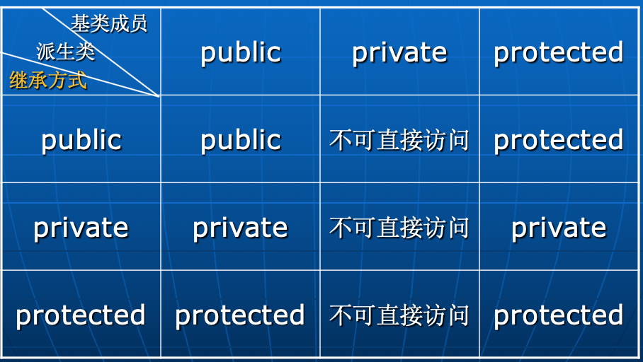

继承是为了软件复用

继承：对一个面向对象的程序，在定义一个新的类时，先把已有程序中的一个或多个类的功能全部包含进来，然后再给出新功能的定义或对已有类的某些功能重新定义。

在继承关系中存在两个类：基类（或称父类）派生类（或称子类）。

派生类拥有基类的所有特征，并可以定义新的特征，或对基类的一些特征进行重定义。

继承分为：单继承和多继承

单继承：一个类只有一个直接基类。

多继承：一个类有多个直接基类。

**单继承**

单继承时，派生类只能有一个直接基类。

class \<派生类名\>：[\<继承方式\>] \<基类名\>

{ \<成员说明表\>

};

```c
如：
class A //基类
{		
    int x,y;
public:
	void f();
	void g();
};
class B: public A //派生类
{
    int z; //新成员
public:
	void h(); //新成员
};

派生类除了拥有新定义的成员外，还拥有基类的所有成员（基类的构造函数和赋值操作符重载函数除外）
定义派生类时一定要见到基类的定义。

C++中，派生类不能直接访问基类的私有成员！！！
class A
{	
    int x,y;
    void k();
public:
	void f();
	void g() { ... x ... }
};
class B: public A
{		
    int z;
public:
	void h() 
	{	... x，y ...  //Error，x、y为基类的私有成员。
	    k();  //Error
		f();  //OK
		g();  //OK，通过函数g访问基类的私有成员x
	}
}; 
有了继承机制以后，一个类的成员有两种被外界使用的场合：
[1]通过类的对象使用。A ha；ha.f();
[2]在派生类中使用，如上面。

//为了解决上面的error。为了在B类中使用x，y这种不能通过对象直接访问的成员，所以：
用访问控制：protected
用protected说明的成员不能通过对象(在类外部)使用，但可以在派生类中使用。（是指[2]在B的内部的成员函数中使用，而无法[1]通过对象使用。）
protected：int x;
protected访问控制缓解了封装与继承的矛盾。

派生类对基类成员的访问除了受到基类的访问控制的限制以外，还要受到标识符作用域的限制。
派生类成员名的作用域等于嵌套在基类作用域中：
    如果派生类中定义了与基类同名的成员，则基类的成员名在派生类的作用域内不直接可见（被隐藏，Hidden）。访问基类同名成员时要用基类名受限。例如:
class B: public A
{		
    int z;
public:
	void f();
	void h()
	{	f();  //B类中的f
		A::f();  //A类中的f
	}
};
B b;
b.f();  //B类中的f
b.A::f();  //A类中的f 
// 即使派生类中定义了与基类同名但参数不同的成员函数，
// 如f(int)，基类的同名函数在派生类的作用域中也是不直接可见的，可以用基类名受限方式来使用之。

```

**派生类对象的初始化**

```c
基类的数据成员由基类的构造函数初始化，
派生类的数据成员由派生类的构造函数初始化。

当创建派生类的对象时：
//先执行基类的构造函数，再执行派生类构造函数。
//默认情况下，调用基类的默认构造函数，如果要调用基类的非默认构造函数，则必须在派生类构造函数的成员初始化表中指出。

class A
{		int x;
	public:
		A() { x = 0; }
		A(int i) { x = i; }
};
class B: public A
{		int y;
	public:
		B() { y = 0; }
		B(int i) { y = i; }
		B(int i, int j):A(i) { y = j; }
};
......
B b1;  //执行A::A()和B::B()，b1.x等于0，b1.y等于0。
B b2(1);  //执行A::A()和B::B(int)，b2.x等于0，b2.y等于1。
B b3(1,2);  //执行A::A(int)和B::B(int,int)，b3.x等于1，
			//b3.y等于2。

```

```c
如果一个类D既有基类B、又有成员对象类M，则
在创建D类对象时，构造函数的执行次序为：
B->M->D
当D类的对象消亡时，析构函数的执行次序为：
D->M->B

```

```c
派生类拷贝构造函数：
    派生类的隐式拷贝构造函数（由编译程序提供）将会调用基类的拷贝构造函数。
    派生类自定义的拷贝构造函数在默认情况下则调用基类的默认构造函数。需要时，可在派生类自定义拷贝构造函数的“成员初始化表”中显式地指出调用基类的拷贝构造函数。 

派生类对象的赋值：
    派生类隐式的赋值操作除了对派生类成员进行赋值外，还将调用基类的赋值操作对基类成员进行赋值。

```

**继承方式**

```c

在C++中，派生类拥有基类的所有成员。问题是：
基类的成员变成派生类的什么成员呢？public、private 或protected？
上面的问题由继承方式决定。继承方式在定义派生类时指定：
class <派生类名>：[<继承方式>] <基类名>
{	<成员说明表>
};
继承方式可以是：public、private和protected。
默认的继承方式为：private。
。
```

注意！！！:

派生类的对象和派生类中的成员函数对基类的访问是不同的。

\<继承方式\>影响的是派生类对象访问的情况，不影响派生类成员函数使用基类的成员。

基类成员属性的影响：单独的protect成员的影响见前文。

继承方式属性结合基类成员属性的影响：子类对象A使用父类成员x时候，x再A中相当于什么属性。A.x是否能正常访问到。


```c
子类型p27开始
如果一个类型S是另一个类型T的子类型，则对用T表达的所有程序P，当用S去替换程序P中的所有T时，程序P的功能不变。
1.一个类型的操作也适合于它的子类型。
2.一个子类型的值可以赋值或作为函数参数传给基类型变量。  

A a;父类
B b;子类
a=b;//ok，多出来的值抛弃了。
b=a;//error，子类多出来的成员的数据不确定，无法赋值
// 其他情况也一样，一个方向可以，另一个方向不可以：
A *p = &b; // ok，关于通过p能否操作子类b的成员变量参考【动态绑定】。
A &x = b;  // ok同理。
```

**代码复用的另一种方式－－聚集**

```c
继承不是代码复用的唯一方式，有些代码复用不宜用继承来实现，如：“飞机”类复用“发动机”类。

class A
{ public:
      void f();
    ......
};
class B
{    A a;
   public:
      void g() 
      { ......
         a.f(); //通过对象a来使用A类的功能
      }
    ......
};
A 和B之间存在聚集关系

继承与聚集两种代码复用方式的比较：
1.继承与封装存在矛盾，聚集则否。
2.继承的代码复用功能常常可以用聚集来实现。（类中多加一个函数，里面直接调用成员对象的对应函数。）
3.继承更容易实现子类型。有聚集关系的两个类没有子类型关系。

```

**面向对象程序设计的多态性**

TODO: private方式继承的子类，是否还有多态性？基类指针指向派生类可以吗？？

回答：不是，private继承时无法利用多态特性。

```c
对于具有public继承关系的两个类，在C++中存在下面的多态：
1.派生类对象的类型既可以是派生类，也可以是基类。（一个对象可以属于多种类型）
2.基类的指针或引用可以指向或引用基类对象，也可以指向或引用派生类对象。（一个对象标识可以属于多种类型，它可以标识多种对象）
3.一个可以发送到基类对象的消息，也可以发送到派生类对象，从而可能会得到不同的解释。（消息的多态）。

所以产生了【消息绑定】问题：向基类的指针或引用所指向或引用的对象发送消息，将调用什么成员函数（基类或派生类）来处理这个消息？


消息的静态绑定
class A
{	int x,y;
public:
	void f();
};
class B: public A
{	int z;
public:
   	void f(); //与A类的f是什么关系？
   	void g();
};
void func1(A& x)
{
	x.f(); //调用A::f还是B::f ？答案是：总是A::f

}
void func2(A *p)
{
	p->f(); //调用A::f还是B::f ？答案是：总是A::f

}
A a;
func1(a);
func2(&a);
B b;
func1(b);  // A::f
func2(&b);// A::f

```

**虚函数－－消息的动态绑定**

```c
一般情况下，需要在func1（或func2）中根据x（或p）实际引用（或指向）的对象来决定是调用A::f还是B::f，即采用动态绑定。
在C++中用虚函数来实现动态绑定。
class A
{		int x,y;
	public:
		virtual void f(); //虚函数
};
class B: public A
{		int z;
	public:
   		void f();
   		void g();
};
void func1(A& x)
{	......
	x.f(); //调用A::f还是B::f ？答案是：A::f或B::f
}
void func2(A *p)
{	......
	p->f(); //调用A::f还是B::f ？答案是：A::f或B::f
}
A a;
func1(a); //在func1中调用A::f
func2(&a); //在func2中调用A::f
B b;
func1(b); //在func1中调用B::f
func2(&b); //在func2中调用B::f

```

**问题：用基类指针接受子类的实例时，可以通过基类指针调用子类的函数从而改变子类成员变量的值吗?**

答案：看情况可以。如下，前提是调用的函数是虚函数, 并且子类正确地重写了这个函数。（理解：毕竟存在于内存中的是子类实例而不是父类，只要确实调用进入了子类的函数，那自然可以进行正常的子类操作。）

评价：这恰恰是【抽象类】的作为中间类的使用例的精华点所在（参考下面【纯虚函数和抽象类】）。这种抽象类父类作为对外接口提供，对外只提供了方法函数纯虚函数，而子类重写父类函数成为了真正的实现类，且子类的相关成员变量也对外隐藏了起来(及时不小心写成了public，通过父类指针也永远不可能直接访问到这个子类的成员变量)。

```c
class Base {
public:
    virtual void someFunction() {
        // 基类的实现
    }
};

class Derived : public Base {
public:
    int derivedVar;
    void someFunction() override {
        // ps: C++11 中的新特性override,用于显式地标记一个函数是用来覆盖基类中的虚函数。它提供了一种明确的方式来确保子类中的函数确实是在覆盖基类的虚函数，以便在编译时进行检查，减少出现因命名错误或函数签名不匹配等问题而导致的 bug。
        // 子类的实现
        derivedVar = 42;  // 修改子类成员变量的值
    }
};
Base* basePtr = new Derived();
basePtr->someFunction();  // 通过基类指针调用子类的函数
```

**虚函数隐含着：基类中的一个成员函数如果被定义成虚函数，则在派生类中定义的、与之具有相同型构的成员函数是对基类该成员函数的重定义（或称覆盖，override）。**

**相同的型构**是指：

派生类中定义的成员函数的名字、参数类型和个数与基类相应成员函数相同，其返回值类型与基类成员函数返回值类型或者相同，或者是基类成员函数返回值类型的public派生类(返回值是一个对象)。

构造函数不能是虚函数，析构函数可以（往往）是虚函数//这样基类指针操作子类进行析构的时候才会调用对应子类的析构函数，否则只能调用到基类。

只有通过基类的指针或引用访问基类的虚函数时才进行动态绑定。

基类的构造函数中对虚函数的调用【不】进行动态绑定

**各种情况：**

```c
class A
{	public:
		A() { f();}
		~A();
		virtual void f();
		void g();
		void h() { f(); g(); }
};
class B: public A
{	public:
		~B();
		void f(); 
		void g(); 
};
......
A a;  //调用A::A()和A::f
a.f();  //调用A::f
a.g();  //调用A::g
a.h();  //调用A::h、A::f和A::g
B b;  //调用B::B(), A::A()和A::f ----- attention!!!
b.f();  //调用B::f
b.g();  //调用B::g
b.h();  //调用A::h、B::f和A::g ----- attention!!!
A *p;
p = &b;
p->f();  //调用B::f
p->A::f(); //调用A::f
p->g();  //调用A::g，对非虚函数的调用采用静态绑定。
p->h();  //调用A::h, B::f和A::g
p = new B;  //调用B::B(), A::A()和A::f
.......
delete p;  //只调用A::~A()，为什么？
                 //因为没有把A的析构函数定义为虚函数！

```

父类virtual，子类相同函数也加virtual，子类函数于是就覆盖了父类。父类-\>f()其实调用了子类的f() 

**什么时候需要定义虚函数：**

* 在设计基类时，有时虽然给出了某些成员函数的实现，但实现的方法可能不是最好，今后可能还会有更好的实现方法。
* 在基类中根本无法给出某些成员函数的实现，它们必须由不同的派生类根据实际情况给出具体的实现。

**纯虚函数和抽象类 **

```c
纯虚函数是没给出实现的虚函数，即函数体为空（=0）的虚函数：
class A
{	......
	public:
		virtual int f()=0; //纯虚函数.
		// ps:复习一下，下面表示不生成默认的【拷贝构造函数】和【赋值运算符】，这样对象用无法用拷贝构造函数和赋值运算。
    	A(const A& p) = delete;
    	A& operator=(const A& p) = delete;

};
包含纯虚函数的类称为抽象类。
抽象类不能用于创建对象，如：
A a;  //Error，A是抽象类

作用：抽象类的作用是为派生类提供一个基本框架和一个公共的对外接口。

真正的抽象类用法：
如同sanjuan的sepolicy一样，.h中存放对外接口是一个SecPolicy基类抽象类里面全是纯虚函数，自己cpp中实现其他的类继承SecPolicy如class SecPolicyImplUnix: public SecPolicy 来实现具体功能。
```

**多继承**

**
**

多继承是指派生类可以有一个以上的直接基类。多继承的派生类定义格式为：

class \<派生类名\>： [\<继承方式\>] \<基类名1\>，

  [\<继承方式\>] \<基类名2\>，…

{ \<成员说明表\>

};

* 继承方式及访问控制的规定同单继承。
* 派生类拥有所有基类的所有成员。
* 基类的声明次序决定：

* 对基类构造函数/析构函数的调用次序。
* 对基类数据成员的存储安排。

```c
class C: public A, public B
{		int r;
	public:
		void fc();
};
```

TODO: ppt剩下内容——多继承名冲突，重复继承(菱形)，虚基类

**虚拟继承**

```c
class C : virtual public B
```


