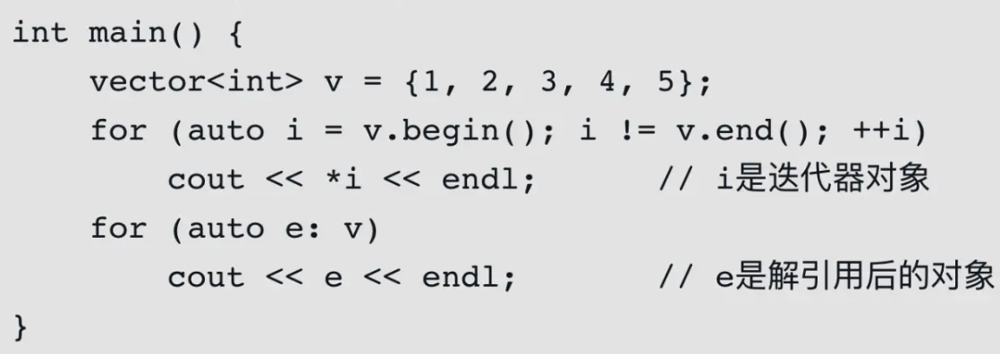

C++11

<http://c.biancheng.net/cplus/11/>

**小特性**

```c
// C++11开始，std::max()可以用来从多个数中求最大值，前提是需要搭配初始化列表。
int m = std::max({1, 2, 3, 4, 5});
```

**inline内联函数**

<https://learn.microsoft.com/zh-cn/cpp/cpp/inline-functions-cpp?view=msvc-170>**
**

 inline 关键字告诉编译器用函数定义中的代码替换每个函数调用实例。

 ***函数直接在调用点展开，编译的时候内联函数不生成函数符号***

 使用内联函数可以使程序更快，因为它们消除了与函数调用关联的开销。 编译器可以使用普通函数无法使用的方式优化内联展开的函数。

 内联代码替换操作由编译器自行决定。 例如，如果某个函数的地址被采用或者由于过大而无法内联，则编译器不会内联该函数。

**inline内联和define宏的区别**

（1）内联函数同宏函数一样将在被调用处进行代码展开，省去了参数压栈、栈帧开辟与回收，结果返回等，从而提高程序运行速度。

（2）内联函数相比宏函数来说，在代码展开时，会做安全检查或自动类型转换（同普通函数），而宏定义则不会。

 (3) 宏定义define只要定义了就会替换，而inline只是建议，编译器可以拒绝替换，在函数较大的时候，编译器可以选择不展开相应的函数。

普通函数有开栈和清栈，inline函数无开栈和清栈。

当执行开销（代码小）\< 调用开销（开栈）时，建议用inline

当执行开销（代码小）\> 调用开销（开栈）时，不建议使用inline

**auto类型 // C++11后**

可以理解为占位符，使用它来做自动类型推导。也就是说，使用了 auto 关键字以后，编译器会在编译期间自动推导出变量的类型

C++11新特性之基本范围的For循环（range-based-for）

<https://blog.csdn.net/hailong0715/article/details/54172848>

C++11也引入了基于范围的for循环，for循环后的括号由冒号“：”分为两部分，第一部分是范围内用于迭代的变量，第二部分则表示将被迭代的范围。

值得指出的是，是否能够使用基于范围的for循环，必须依赖于一些条件。首先，就是for循环迭代的范围是可确定的。对于类来说，如果该类有begin和end函数，那么begin和end之间就是for循环迭代的范围。对于数组而言，就是数组的第一个和最后一个元素间的范围。其次，基于范围的for循环还要求迭代的对象实现++和==等操作符。对于标准库中的容器，如string、array、vector、deque、list、queue、map、set等，不会有问题，因为标准库总是保证其容器定义了相关的操作。普通的已知长度的数组也不会有问题。而用户自己写的类，则需要自行提供相关操作。

*另外一点，习惯了使用迭代器的C++程序员可能需要注意，就是基于范围的循环使用在标准库的容器中时，如果使用auto来声明迭代的对象的话，那么这个对象**不会是迭代器对象**。*



```c
std::vector<int> vec {1,2,3,4,5,6,7,8,9,10};
for (auto& n :vec)  // 使用&引用，这样里面的值才能修改
	std::cout << n;  // 返回的
	
// 冒号循环：
vector<int> nums;
for(int num : nums) {
    int value = num;
}
```

auto的使用注意：

```c
auto ：拷贝，用于for的range循环，无法修改任何东西。可以修改迭代器指向的内容。
auto& ：左值引用，只能接左值（和常量右值），如用于for的range循环可以修改值value，但不能修改map的key，因为map的key是有序的，这样会破坏map结构。
auto&& ：万能引用，能接左值和右值
const auto& ：const 万能引用，能接左值和右值
const auto&& ：常量右值引用，只能接右值

```

**左值和右值 // ****C++11后**

[https://www.bilibili.com/video/BV17G411X7wN/?spm\_id\_from=333.788.recommend\_more\_video.0&vd\_source=7d2082262d19abdd2e30ff5f60dc1fdf](https://www.bilibili.com/video/BV17G411X7wN/?spm_id_from=333.788.recommend_more_video.0&vd_source=7d2082262d19abdd2e30ff5f60dc1fdf)

C++11 引入了右值引用的概念

* 可以取地址的，有名字的，非临时的就是左值；
* 不能取地址的，没有名字的，临时的就是右值；
* 可见立即数，函数返回的值等都是右值；而非匿名对象(包括变量)，函数返回的引用，const对象等都是左值。

**实际作用**：引入右值引用，就是为了移动语义。移动语义就是为了减少拷贝。例如将资源（如内存、文件句柄等）从一个对象转移到另一个对象，而无需进行深层拷贝。这在C++11及更高版本的标准中非常有用，可以提高性能和资源管理效率。

```c
int a = 10;
int &b = 11; // 错！不可以为 10 这个右值建立引用，只能const int &b = 11;
int &b = a;  // 定义一个左值引用变量
b = 20;      // 通过左值引用修改引用内存的值

// 定义右值引用的格式如下
int &&var = 10;
// 在汇编层面右值引用做的事情和常引用是相同的，即产生临时量来存储常量。但是，唯一 一点的区别是，右值引用可以用于修改被引用对象，因为它们通常用于实现移动操作，这需要对资源进行修改。
int num = 10;
//int && a = num;  //右值引用不能初始化为左值
int && a = 10;
```

移动构造函数（Move Constructor）// C++11后

它允许将资源从一个对象移动到另一个对象，而不是进行传统的复制。这在处理动态分配的资源（如堆内存、文件句柄等）时非常有用，可以提高程序的性能和效率。

 移动构造函数通常与右值引用（Rvalue Reference）一起使用，其语法如下：

```c
class MyClass {
public:
    // 移动构造函数，接受右值引用作为参数
    MyClass(MyClass&& other) {
        // 进行资源的移动，而不是复制
        // 将其他对象的资源转移到当前对象
        // 通常需要将其他对象的资源指针置为空，以避免资源二次释放
    }
};

移动构造函数的关键特点包括：
1.接受一个右值引用作为参数，通常是另一个对象的临时对象或即将销毁的对象。
2.在移动构造函数内部，通常会将其他对象的资源（如指针、资源句柄等）移动到当前对象，并将其他对象的资源指针置为空（或采取其他适当的措施，以确保资源的安全移动和避免资源泄漏）。

```

**std::move**

将左值转为右值引用。

```c
//例1
int x = 42;
int y = std::move(x);
std::move 只是将 x 的值移动给 y，而不是复制。这意味着 x 的值将转移到 y，并且 x 将变得未定义。
std::move 并不会修改对象的地址，它只是告诉编译器将对象的值视为右值，从而触发移动语义。这意味着x和y的地址在栈上仍然存在。

//例2 见智能指针【shared_ptr】！！！！
```

C++17 structured bindings

```c

auto [it, ok] = my_map.insert(...);
for (auto&& [key, value]: my_map) {...}

```

智能指针

<http://c.biancheng.net/view/7898.html>

```c
C++98 提供了 auto_ptr 模板的解决方案（已经被11弃用）
C++11 增加unique_ptr、shared_ptr 和weak_ptr
```

**unique\_ptr**

实现独占式拥有或严格拥有概念，保证两个指针不能指向同一个资源。它对于避免资源泄露(例如“以new创建对象后因为发生异常而忘记 调用delete”)特别有用。

**特性**：无法进行左值unique\_ptr复制构造，也无法进行左值复制赋值操作，但允许临时右值赋值构造和赋值。如：

```c
unique_ptr<string> p3 (new string ("auto")); //#4
unique_ptr<string> p4；
p4 = p3;    //此时会报错！！
unique_ptr<string> p5 = p3;     //也错误！！

// 编译器认为p4=p3非法，避免了p3不再指向有效数据的问题。因此，unique_ptr 比auto_ptr更安全。

unique_ptr<string> pu1(new string ("hello world"));
unique_ptr<string> pu3;
pu3 = unique_ptr<string>(new string ("You"));// #2 allowed
// 此时pu3原本的资源(如果有的话）会被释放，指向新的资源。
```


**shared\_ptr**

 shared\_ptr实现共享式拥有概念。多个智能指针可以指向相同对象，该对象和其相关资源会在“最后一个引用被销毁”时候释放。

 它使用计数机制来表明资源被几个指针共享。可以通过成员函数 use\_count()来查看资源的所有者个数。

 除了可以通过new来构造，还可以通过传 入auto\_ptr, unique\_ptr,weak\_ptr来构造。当我们调用release()时，当前指 针会释放资源所有权，计数减一。当计数等于0时，资源会被释放。

```c
// 常用构造函数
std::shared_ptr<int> p1;             //不传入任何实参
std::shared_ptr<int> p2(nullptr);    //传入空指针 nullptr
    // 空的 shared_ptr 指针，其初始引用计数为 0，而不是 1。
std::shared_ptr<int> p3(new int(10));
std::shared_ptr<int> p3 = std::make_shared<int>(10);
    // 以上2种方法相同。
    // Tip:使用:make_shared可以减少内存分配次数，并提高性能，因为它将内存分配和对象的构造合并到一个步骤中。

//调用拷贝构造函数
std::shared_ptr<int> p4(p3);
    //或者 std::shared_ptr<int> p4 = p3;
//调用移动构造函数
std::shared_ptr<int> p5(std::move(p4)); 
    //或者 std::shared_ptr<int> p5 = std::move(p4);
如上所示，p3 和 p4 都是 shared_ptr 类型的智能指针，因此可以用 p3 来初始化 p4，此时调用拷贝构造函数。
需要注意的是，如果 p3 为空智能指针，则 p4 也为空智能指针，其引用计数初始值为 0；反之，则表明 p4 和 p3 指向同一块堆内存，同时该堆空间的引用计数会加 1。
而对于 std::move(p4) 来说，该函数会强制将 p4 转换成对应的右值，因此初始化 p5 调用的是移动构造函数。另外和调用拷贝构造函数不同，用 std::move(p4) 初始化 p5，会使得 p5 拥有了 p4 的堆内存，而 p4 则变成了空智能指针。

// 注意，同一普通指针不能同时为多个shared_ptr对象赋值，否则会导致程序发生异常。例如：
int* ptr = new int;
std::shared_ptr<int> p1(ptr);//对
std::shared_ptr<int> p2(ptr);//错误


成员函数：
use_count()  返回引用计数的个数
unique() 返回是否是独占所有权( use_count 为 1)
swap()  交换两个shared_ptr对象(即交换所拥有的对象)
reset() 放弃内部对象的所有权或拥有对象的变更,会引起原有对象的引用计数的减少
get()   返回内部对象(指针), 由于已经重载了()方法, 因此和直接使用对象是一样的. 如 shared_ptrsp(new int(1)); sp 与 sp.get()是等价的


```

**weak\_ptr**

<https://changkun.de/modern-cpp/zh-cn/05-pointers/>

* **弱引用**：std::weak\_ptr 用于创建弱引用，它不会增加对象的引用计数。当所有 std::shared\_ptr 对象都销毁后，对象的内存会被释放，不管是否有 std::weak\_ptr 引用它。
* **避免循环引用**：std::weak\_ptr 通常用于避免循环引用的问题。循环引用是指两个或多个对象互相持有对方的 std::shared\_ptr，导致对象无法被释放。通过将其中一个对象的引用使用 std::weak\_ptr 来打破循环引用，可以确保对象在不再被需要时能够被正确释放。
* **访问 std::shared\_ptr**：std::weak\_ptr 不能直接访问对象，因为它不增加对象的引用计数。要访问对象，你需要将 std::weak\_ptr 转换为 std::shared\_ptr，但需要注意转换时需要检查对象是否存在，以避免访问已经被释放的对象。

---

C++11 类成员直接初始化

在C++11标准之后，你可以在类的定义中为成员变量提供默认初始化值，就像这样：

```c
class MyClass {
public:
    int memberA = 1;
    int memberB = 2;
    MyClass() : memberB(42) {
        // 在构造函数的成员初始化列表中，我们将 memberB 的值重新初始化为 42
    }
};

// 顺序在构造函数开始之前！
```

